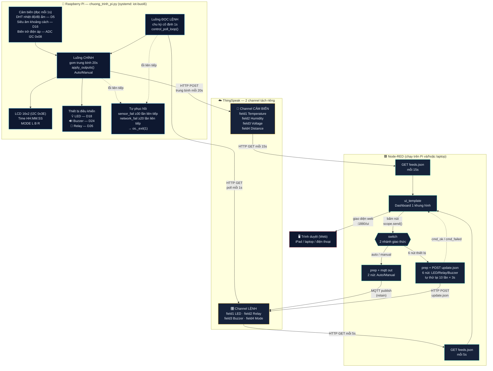
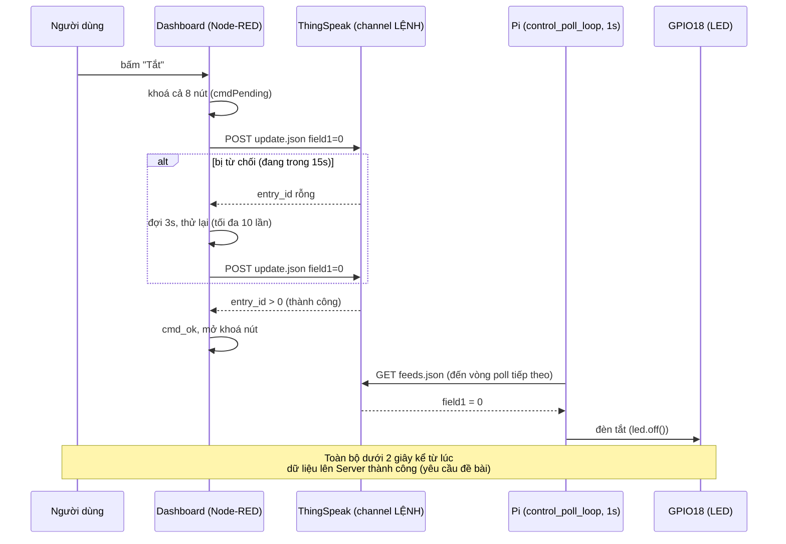

# Kiến trúc hệ thống — Buổi 6

Sơ đồ dưới đây phản ánh đúng những gì đang chạy thật trên `pi4-tdbao`
(`chuong_trinh_pi.py` qua systemd `iot-buoi6`) và Node-RED (chạy được cả
trên Pi lẫn trên máy khác, cùng đọc/ghi 2 channel ThingSpeak thật).

## Vì sao tách 2 channel

ThingSpeak (gói miễn phí) chỉ cho ghi **1 lần / ~15-17 giây trên cùng một
channel**. Pi phải gửi trung bình cảm biến **mỗi 20 giây** — nếu dùng chung
1 channel với lệnh điều khiển thì mỗi chu kỳ chỉ còn vài giây trống cho nút
bấm, lệnh HTTP từ Web bị từ chối liên tục. Tách riêng thì channel LỆNH luôn
rảnh cho nút bấm, không tranh chấp với việc Pi ghi cảm biến.

## Vì sao Pi không subscribe MQTT

ThingSpeak chỉ cấp **một** bộ danh tính MQTT cho mỗi channel
(`client_id` = `username`). Nếu Web (publish) và Pi (subscribe) cùng mở kết
nối bằng chung client_id, broker sẽ đá kết nối cũ mỗi lần có kết nối mới,
làm rớt phần lớn lệnh. Giải pháp: chỉ Web giữ kết nối MQTT; Pi đọc lệnh
bằng **HTTP polling nhịp cố định 1 giây** — vẫn nhận đủ cả 8 nút vì
ThingSpeak lưu chung mọi lần ghi (bất kể giao thức) vào cùng 1 feed.

## Vì sao 2 nút Auto/Manual đi MQTT, 6 nút còn lại đi HTTP

Đề bài mức độ 3 (buổi 5 lớp thầy Thanh) ghi rõ: *"Bắt buộc nút nhấn chọn
chế độ phải sử dụng giao thức MQTT; nút nhấn điều khiển phải sử dụng giao
thức HTTP."* Node `switch` trong flow tách thẳng theo đúng ràng buộc này —
xem trực tiếp trên sơ đồ khối Node-RED (nhóm `5a` và `5b`).

## Vòng đời một lệnh Manual (ví dụ bấm "Tắt LED")

