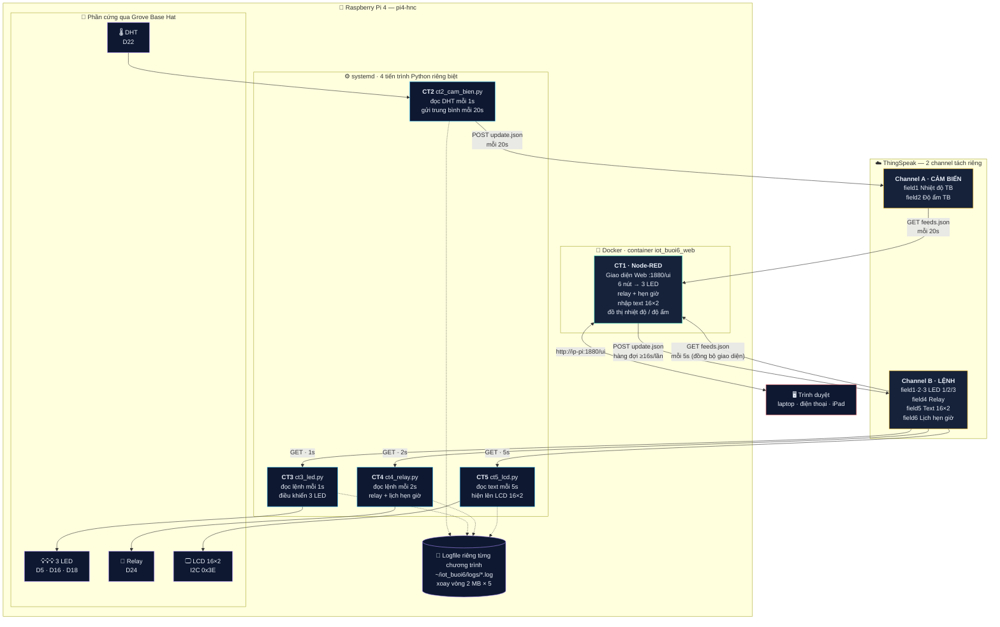
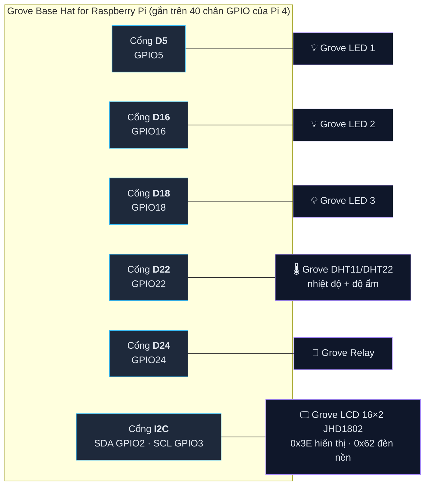
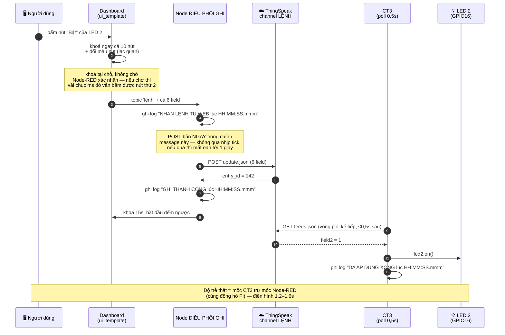
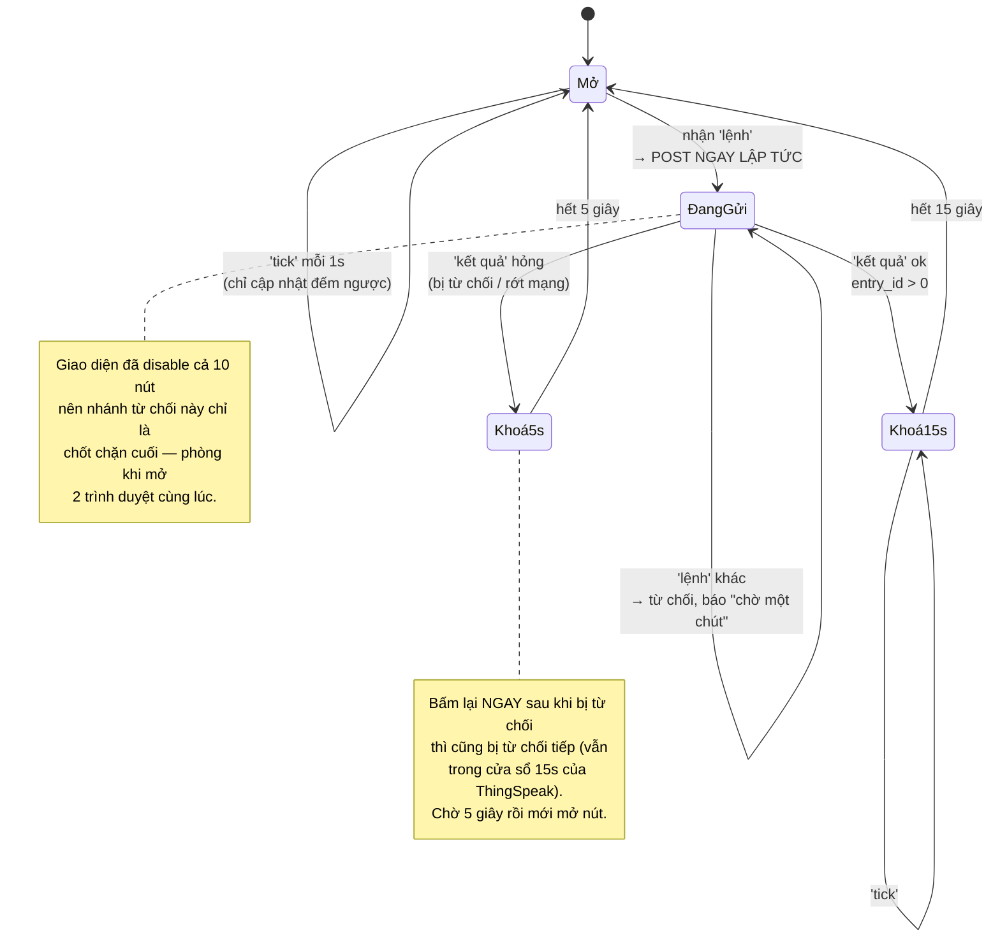
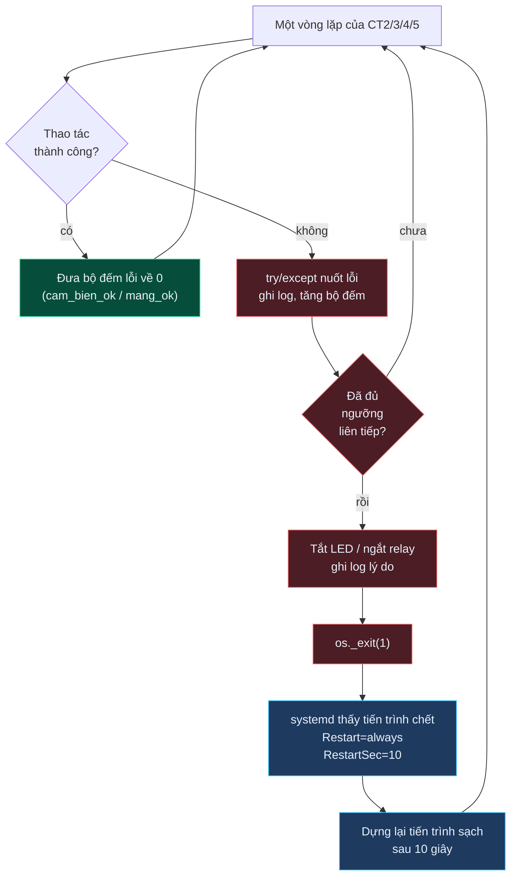
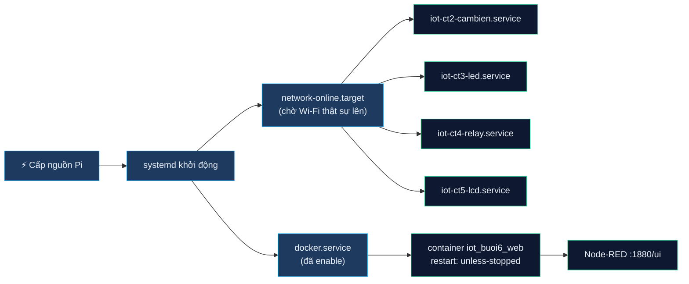

# Kiến trúc hệ thống — Buổi 6 lớp thầy Kiên, mức 15 điểm

## 1. Sơ đồ tổng thể



## 2. Sơ đồ kết nối phần cứng

Toàn bộ thiết bị cắm qua **Grove Base Hat for Raspberry Pi** — không hàn, không
breadboard, mỗi module một cáp Grove 4 chân vào đúng cổng in sẵn trên hat.



Mỗi cáp Grove mang 4 dây: `GND`, `VCC (3.3V/5V)`, `SIG`, `NC` — hat đã nối sẵn
nguồn và mass, chương trình chỉ làm việc với chân `SIG`.

| Module | Cổng | Chân BCM | Chương trình dùng | Kiểu |
|---|---|---|---|---|
| DHT11 / DHT22 | D22 | GPIO22 | CT2 | vào — 1 dây, giao thức riêng |
| LED 1 | D5 | GPIO5 | CT3 | ra — mức cao là sáng |
| LED 2 | D16 | GPIO16 | CT3 | ra |
| LED 3 | D18 | GPIO18 | CT3 | ra |
| Relay | D24 | GPIO24 | CT4 | ra — mức cao là đóng tiếp điểm |
| LCD 16×2 JHD1802 | I2C | GPIO2/GPIO3 | CT5 | I2C `0x3E` + `0x62` |

**Ba tiến trình không tranh chấp nhau** vì mỗi tiến trình giữ một nhóm chân
riêng: CT3 giữ GPIO5/16/18, CT4 giữ GPIO24, CT5 giữ bus I2C. CT2 chỉ đọc GPIO22.

## 3. Vòng đời một lệnh — bấm "Bật LED 2"

Quy tắc vận hành: **mỗi lần chỉ bấm được một nút**, bấm xong cả 10 nút bị khoá
15 giây. Nhưng riêng lệnh vừa bấm phải tới được Pi **dưới 2 giây**.

Hai con số này đo hai quãng khác nhau nên không mâu thuẫn:

```
bấm ─┬──────────────── dưới 2 giây ─────────────────┐
     │  POST ~0,5s   ThingSpeak lưu   CT3 poll 0,5s │
     └──────────────────────────────────────────────┘
     └──────────────────── khoá 15 giây ────────────────────┤ mới bấm được nút tiếp
```



### Ngân sách 2 giây

| Chặng | Thời gian | Ghi chú |
|---|---|---|
| Bấm → POST rời Node-RED | ~5 ms | bắn thẳng, không qua nhịp tick |
| POST → ThingSpeak lưu xong | 0,3 – 0,9 s | phụ thuộc đường truyền |
| Chờ vòng poll kế tiếp của CT3 | ≤ 0,5 s | = `CT3_NHIP_DOC` |
| GET của CT3 đi và về | 0,3 – 0,5 s | |
| `led.on()` | < 1 ms | |
| **Xấu nhất** | **≈ 1,9 s** | ✅ đạt |

Nếu để `CT3_NHIP_DOC = 1` như ban đầu thì xấu nhất là `0,9 + 1,0 + 0,5 = 2,4s` —
**vỡ mốc**. Đó là lý do nhịp poll của CT3 phải là **0,5 giây**, và phải là
**chu kỳ cố định** (trừ đi thời gian request) chứ không phải `sleep(0.5)` sau mỗi
request — nếu không chu kỳ thật thành `0,5 + 0,4 = 0,9s` và lại vỡ.

### Đo độ trễ thật để quay video

Hai mốc, cùng đồng hồ của Pi (Node-RED chạy trong Docker trên chính Pi, đã đặt
`TZ=Asia/Ho_Chi_Minh`), cả hai đều có mili giây:

```bash
docker logs -f iot_buoi6_web | grep -E "NHAN LENH TU WEB|GHI THANH CONG"
tail -f ~/iot_buoi6/logs/ct3_led.log | grep "DA AP DUNG XONG"
```

Độ trễ = mốc `DA AP DUNG XONG` − mốc `NHAN LENH TU WEB`.

## 4. Máy trạng thái của node ĐIỀU PHỐI GHI



**Vì sao không cần hàng đợi:** channel LỆNH chỉ có Web ghi, mà Web tự khoá 15
giây giữa hai lần ghi, nên không bao giờ chạm giới hạn của ThingSpeak → không bị
từ chối → không phải xếp hàng, không phải thử lại.

Đồng hồ khoá nằm ở **Node-RED**, không nằm ở trình duyệt — mở 2 tab hay 2 máy
cùng lúc thì cả hai đều thấy chung một đồng hồ, không ai lách được.

## 5. Cơ chế tự phục hồi

Đề bắt buộc *"chương trình phải tự reset/khởi động lại khi có lỗi phát sinh"*.
Hai tầng:



| Bộ đếm | Tăng khi | Ngưỡng | Chương trình dùng |
|---|---|---|---|
| `loi_cam_bien` | DHT không ra giá trị hợp lệ / ghi LCD hỏng | 30 lần liên tiếp | CT2, CT5 |
| `loi_mang` | Gọi ThingSpeak thất bại | 20 lần liên tiếp | CT2, CT3, CT4, CT5 |

**Mỗi lần thành công đều đưa bộ đếm về 0**, nên lỗi lẻ tẻ ngắt quãng không bao
giờ cộng dồn tới ngưỡng — chỉ lỗi *liên tiếp* mới khiến chương trình khởi động
lại. Đúng tinh thần đề: lỗi vặt thì `try/except` chạy tiếp, lỗi thật thì reset.

Hai chi tiết dễ sai:

- Dùng `os._exit(1)` chứ không phải `sys.exit()`. `sys.exit()` chỉ ném
  `SystemExit`; nếu hàm thoát được gọi từ một luồng phụ thì chỉ luồng đó chết,
  tiến trình vẫn sống trong trạng thái què quặt.
- `os._exit()` **bỏ qua khối `finally`**, nên phải tự tắt LED / ngắt relay
  *trước* khi gọi — GPIO không tự về mức thấp khi tiến trình chết.

## 6. Tự khởi động khi bật nguồn



Các unit khai báo `Wants=network-online.target` + `After=network-online.target`.
Lúc mới cấp nguồn, Wi-Fi lên **chậm hơn** systemd — không chờ thì lần chạy đầu
sẽ rớt mạng ngay, đốt bộ đếm lỗi vô cớ rồi restart liên tục vài vòng.

`StartLimitIntervalSec=0` để systemd **không bao giờ bỏ cuộc**: mặc định nó
ngừng thử sau 5 lần restart trong 10 giây, mất mạng cả tiếng là service chết
hẳn — trong khi đề đòi thiết bị phải tự sống lại.
