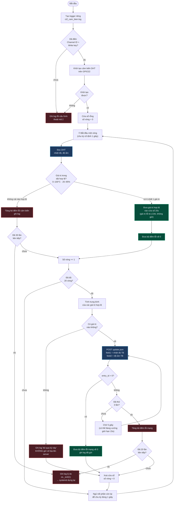

# CT2 — Đọc cảm biến và gửi trung bình lên server

File: [`../raspberry/ct2_cam_bien.py`](../raspberry/ct2_cam_bien.py)

> *"Chương trình 2 đọc dữ liệu nhiệt độ, độ ẩm mỗi 1s, gửi lên server giá trị
> nhiệt độ, độ ẩm trung bình mỗi 20s."*

## Ba chỗ đáng chú ý

**Lọc trước khi cộng, không lọc sau.** Đề ghi *"nếu dữ liệu cảm biến bị lỗi thì
không được gửi lên Server mà phải đọc lại"*. Giá trị ngoài dải bị loại ngay tại
chỗ đọc, không bao giờ vào cửa sổ trung bình — nếu để lọt một số 0 vào rồi mới
lọc thì trung bình đã sai.

**DHT hỏng thường trả về đúng `0.0/0.0`**, rơi vào đây bị loại luôn vì độ ẩm 0%
nằm ngoài dải 20–95%.

**Đếm vòng chứ không đo đồng hồ.** Chu kỳ đã được giữ chính xác 1 giây, nên đếm
20 vòng đơn giản hơn và không bị trôi so với việc so mốc `datetime.now()`.
