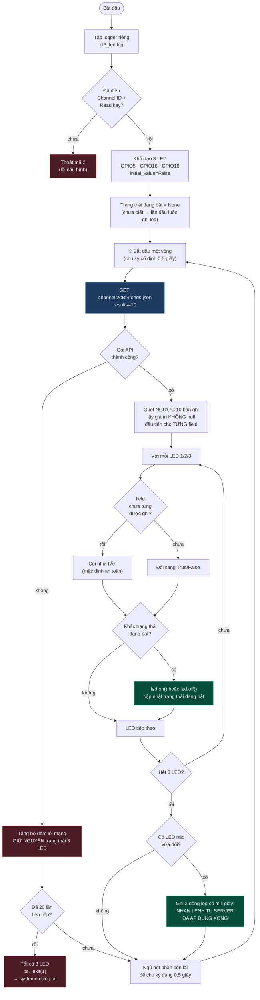

# CT3 — Đọc lệnh nút nhấn từ server, điều khiển 3 LED

File: [`../raspberry/ct3_led.py`](../raspberry/ct3_led.py)

> *"Chương trình 3 đọc dữ liệu nút nhấn từ server, điều khiển LED theo giá trị
> nhận được."*

## Ba chỗ đáng chú ý

**Vì sao 0,5 giây chứ không phải 1 giây.** Ràng buộc: từ lúc bấm nút trên Web
đến lúc đèn sáng phải dưới 2 giây.

| Chặng | Thời gian |
|---|---|
| Web POST lên ThingSpeak | 0,3 – 0,9 s |
| Chờ vòng poll kế tiếp | ≤ nhịp poll |
| GET của CT3 đi và về | 0,3 – 0,5 s |

Nhịp 1s cho xấu nhất `0,9 + 1,0 + 0,5 = 2,4s` → **vỡ mốc**.
Nhịp 0,5s cho xấu nhất `0,9 + 0,5 + 0,5 = 1,9s` → **đạt**.

**Phải là chu kỳ cố định.** `VongLapDinhNhip` trừ đi thời gian vừa tốn cho
request. Nếu chỉ `sleep(0.5)` sau mỗi request thì chu kỳ thật là
`0,5 + 0,4 = 0,9s` và mốc 2 giây lại vỡ.

**Vì sao quét ngược từng field.** Mỗi lần ghi, ThingSpeak tạo một dòng mới và đặt
`null` cho field không gửi trong lần đó. Chỉ nhìn dòng cuối sẽ tưởng các field
kia đã bị xoá.

**Chỉ tác động GPIO khi có thay đổi.** Gọi `led.on()` mỗi 0,5 giây cũng không
hỏng gì, nhưng logfile sẽ đầy rác và không còn dùng để đối chiếu độ trễ được nữa.
