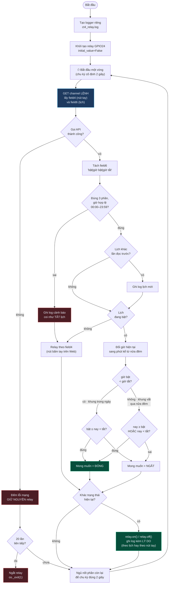

# CT4 — Điều khiển relay theo lệnh và theo lịch hẹn giờ

File: [`../raspberry/ct4_relay.py`](../raspberry/ct4_relay.py) · phần **13 điểm**

> *"Thêm chương trình Điều khiển bật/tắt thiết bị relay theo giá trị đọc về từ
> server"* · *"Giao diện Web thêm giao diện để người dùng hẹn giờ bật tắt thiết
> bị relay"*

## Ba chỗ đáng chú ý

**Khung giờ vắt qua nửa đêm.** `22:00 → 06:00` nghĩa là bật từ 22h hôm nay đến
6h sáng hôm sau. Nếu chỉ viết `bật ≤ nay < tắt` thì `1320 ≤ nay < 360` không bao
giờ đúng — relay sẽ không bao giờ đóng. Phải tách riêng thành
`nay ≥ bật HOẶC nay < tắt`.

**Giờ bật trùng giờ tắt** cho khung rỗng → luôn ngắt. Không thể vừa bật vừa tắt
tại cùng một thời điểm, nên chọn trạng thái an toàn. Giao diện Web cũng cảnh báo
trước khi gửi.

**Chuỗi lịch sai định dạng thì rơi về chế độ tay**, không kẹt cứng ở một trạng
thái khó đoán. Ai đó ghi tay bằng `curl` một chuỗi rác thì relay vẫn còn điều
khiển được bằng nút bấm.

**Vì sao gửi lịch lên server thay vì hẹn giờ ngay trong Node-RED.** Đề yêu cầu
rõ chương trình này *"điều khiển relay theo giá trị đọc về từ server"*. Đặt lịch
trên server còn thêm hai cái lợi thật: lịch sống sót qua cả lần khởi động lại
Node-RED, và người chấm mở channel lên là thấy được lịch đang đặt.
