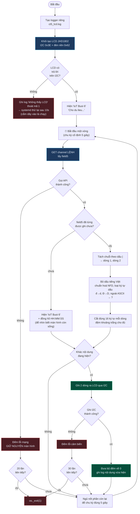

# CT5 — Đọc text 16×2 từ server, hiển thị lên LCD

File: [`../raspberry/ct5_lcd.py`](../raspberry/ct5_lcd.py) · phần **13 điểm**

> *"Đọc dữ liệu text 16x2 từ server, hiển thị giá trị lên LCD 16x2. Có logfile
> riêng; chương trình cũng tự khởi động như các chương trình khác."*

## Ba chỗ đáng chú ý

**Tự viết driver LCD thay vì dùng `grove.display.jhd1802`.** Thư viện Grove
**nuốt** lỗi I2C — LCD tuột dây mà chương trình vẫn báo "chạy bình thường",
không hiện gì. Không phát hiện được lỗi thì không thể tự khởi động lại, mà đó là
yêu cầu bắt buộc của đề. Driver tự viết để mọi lỗi ghi I2C ném thẳng ra ngoài
cho vòng lặp đếm.

**Bỏ dấu tiếng Việt.** LCD 16×2 chỉ có bảng ký tự ASCII, không có "ệ" hay "ộ".
Chuẩn hoá NFD tách chữ cái khỏi dấu rồi loại các ký tự dấu (category `Mn`);
riêng "đ"/"Đ" không tách được bằng NFD nên phải đổi tay. Ô xem trước trên Web
làm đúng phép biến đổi này nên nhìn trước là biết LCD sẽ hiện gì.

**Vẫn cắt lại 16 ký tự dù Web đã chặn.** Không bao giờ tin dữ liệu từ bên ngoài:
ai đó ghi tay bằng `curl` một chuỗi 100 ký tự thì LCD sẽ tràn sang dòng dưới và
hiện ra rác.

**Thoát mã 1 khi không thấy LCD, không phải mã 2.** Mã 2 là lỗi cấu hình (cần
người sửa file), systemd sẽ dựng lại vô ích. Ở đây chỉ là chưa cắm dây — để mã 1
cho systemd cứ thử lại đều đặn, cắm dây vào là chạy, không cần ai ssh vào.
