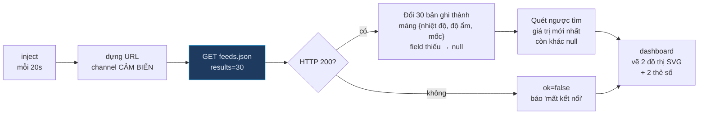
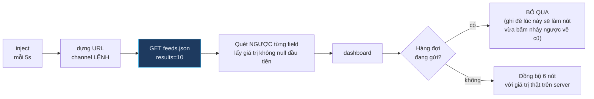
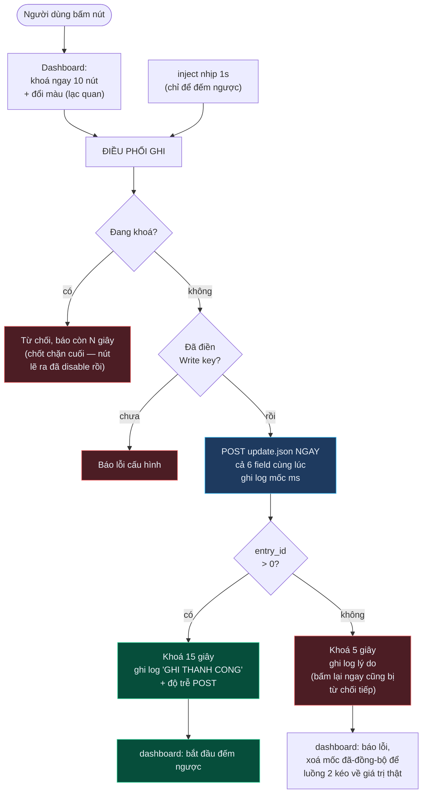

# CT1 — Ba luồng của flow Node-RED

File: [`../node-red/flows.json`](../node-red/flows.json) · giao diện ở
[`../node-red/dashboard_template.html`](../node-red/dashboard_template.html)

> *"Chương trình 1 Giao diện Web node-red trên raspberry. Có 6 nút nhấn để điều
> khiển 3 LED, có giao diện hiển thị giá trị nhiệt độ, độ ẩm, trạng thái LED."*

## Luồng 1 · Đọc cảm biến (mỗi 20s)

Giữ `null` thay vì đổi thành 0: đồ thị bỏ qua điểm null, còn đổi thành 0 thì
đường vẽ tụt xuống đáy thành hình răng cưa.

## Luồng 2 · Đọc trạng thái lệnh (mỗi 5s)

Đây là cơ chế tự chữa: mở Web trên máy thứ hai, bấm F5, hay Node-RED vừa khởi
động lại — sau tối đa 5 giây giao diện tự khớp với trạng thái thật.

## Luồng 3 · Ghi lệnh (một nút, khoá 15 giây)

**Vì sao POST bắn ngay chứ không chờ nhịp tick:** ngân sách "bấm → Pi xử lý" chỉ
có 2 giây, mà chờ nhịp 1 giây là mất oan nửa ngân sách. Nhịp tick ở đây chỉ để
cập nhật đồng hồ đếm ngược trên giao diện.

**Vì sao gửi cả 6 field dù chỉ đổi 1 nút:** dòng feed mới nhất trên ThingSpeak
luôn đầy đủ → Pi chỉ cần 1 request là đọc được toàn bộ trạng thái, thay vì 6.
