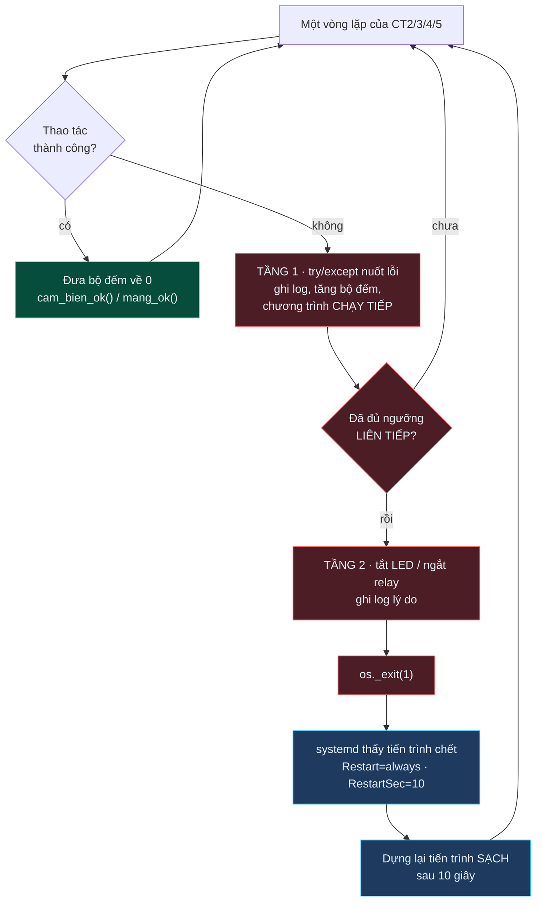

# Cơ chế tự phục hồi — dùng chung cho CT2 → CT5

File: [`../raspberry/thu_vien_chung.py`](../raspberry/thu_vien_chung.py) —
lớp `TheoDoiSucKhoe`

> *"Chương trình phải tự reset/khởi động lại khi có lỗi phát sinh trong quá
> trình hoạt động. Thao tác chạy chương trình thủ công không được chấp nhận."*

## Hai tầng

| Bộ đếm | Tăng khi | Ngưỡng | Chương trình dùng |
|---|---|---|---|
| `loi_cam_bien` | DHT không ra giá trị hợp lệ / ghi LCD hỏng | 30 lần liên tiếp | CT2, CT5 |
| `loi_mang` | Gọi ThingSpeak thất bại | 20 lần liên tiếp | CT2, CT3, CT4, CT5 |

## Vì sao đếm "liên tiếp" chứ không đếm tổng

Mỗi lần thành công đều đưa bộ đếm về 0. Nhờ vậy lỗi lẻ tẻ ngắt quãng (nhiễu I2C,
một gói tin rớt) **không bao giờ** cộng dồn tới ngưỡng — chương trình chỉ khởi
động lại khi hỏng thật sự, kéo dài. Đúng tinh thần đề: lỗi vặt thì `try/except`
chạy tiếp, lỗi thật thì reset.

## Hai chi tiết dễ sai

**Dùng `os._exit(1)` chứ không phải `sys.exit()`.** `sys.exit()` chỉ ném
`SystemExit`. Nếu hàm thoát được gọi từ một luồng phụ thì chỉ luồng đó chết, tiến
trình vẫn sống trong trạng thái què quặt — còn thở nhưng không còn làm việc gì.
`os._exit()` kết thúc cả tiến trình từ bất kỳ đâu.

**`os._exit()` bỏ qua khối `finally`.** Phải tự tắt LED / ngắt relay *trước* khi
gọi — GPIO không tự về mức thấp khi tiến trình chết, đang bật mà thoát ngang thì
đèn sáng mãi. Bước dọn dẹp nằm trong `try/finally` để dù có lỗi gì vẫn thoát
được: một ngoại lệ ở đây mà bị `except Exception` của vòng lặp nuốt mất thì tiến
trình chạy tiếp trong trạng thái hỏng mà không ai biết.

## Ba mã thoát

| Mã | Ý nghĩa | systemd làm gì |
|---|---|---|
| `0` | Kết thúc bình thường (Ctrl+C) | `Restart=always` → vẫn dựng lại |
| `1` | Lỗi vận hành: cảm biến hỏng, rớt mạng, chưa cắm LCD | dựng lại sau 10 giây |
| `2` | **Lỗi cấu hình**: chưa điền API key, không khởi tạo được cảm biến | vẫn dựng lại, nhưng log nói rõ cần người vào sửa `cau_hinh.py` |

## Tại sao `StartLimitIntervalSec=0`

Mặc định systemd **bỏ cuộc** sau 5 lần restart trong 10 giây. Mất mạng cả tiếng
là service chết hẳn, thiết bị nằm im — trong khi đề đòi thiết bị phải tự sống
lại. Đặt `0` để systemd không bao giờ bỏ cuộc.
