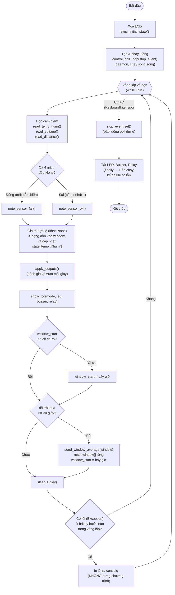

# Lưu đồ `main()` — dòng 561

**Ghi chú:**
- Khối "Có lỗi" bọc toàn bộ thân vòng lặp bằng `try/except` — đúng gợi ý của
  đề: lỗi lẻ tẻ (cảm biến đọc lỗi 1 lần, mạng chập chờn) thì in log rồi
  **chạy tiếp**, không dừng hẳn chương trình.
- `note_sensor_fail()` chỉ **đếm dồn**; việc thoát hẳn chương trình (khi lỗi
  kéo dài liên tiếp) nằm trong `fail_exit()` — xem
  [10_tu_phuc_hoi.md](10_tu_phuc_hoi.md).
- Luồng `control_poll_loop()` chạy **song song, độc lập** với vòng lặp này —
  xem [03_control_poll_loop.md](03_control_poll_loop.md).
