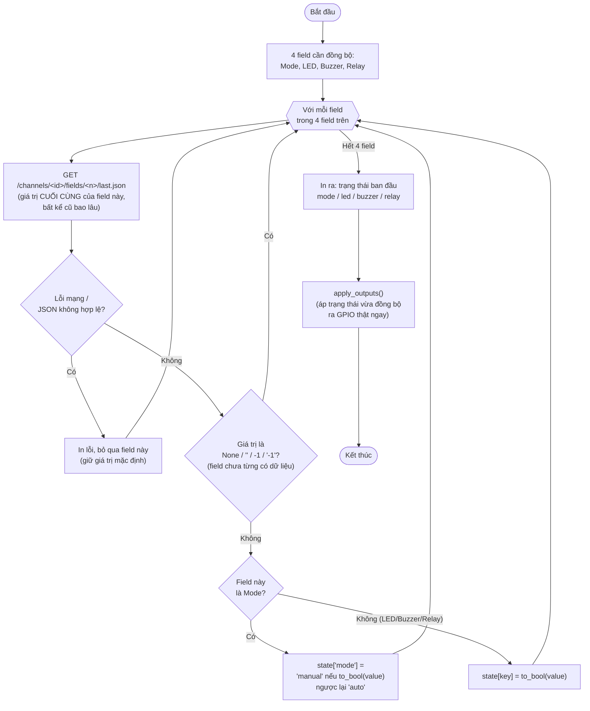

# Lưu đồ `sync_initial_state()` — dòng 443

Đọc trạng thái lệnh **hiện tại** (không phải lịch sử) ngay lúc chương trình
vừa khởi động/khởi động lại, để không bị "quên mất" chế độ Manual đã chọn từ
trước.

**Vì sao không dùng `poll_http_commands()` cho việc này?** Hàm đó chỉ quét
30 bản ghi gần nhất trên channel LỆNH; vì Pi ghi cảm biến (channel khác) mỗi
20s không ảnh hưởng ở đây, nhưng nếu một lệnh (vd chọn Manual) đã được bấm từ
30 phút trước thì nó đã "trôi" ra ngoài 30 bản ghi gần nhất — Pi sẽ hiểu nhầm
là chưa có lệnh nào và quay về mặc định Auto. `sync_initial_state()` dùng
API riêng của ThingSpeak (`fields/<n>/last.json`) trả về đúng giá trị cuối
cùng của từng field, bất kể cũ bao lâu, nên không bị lỗi này.
