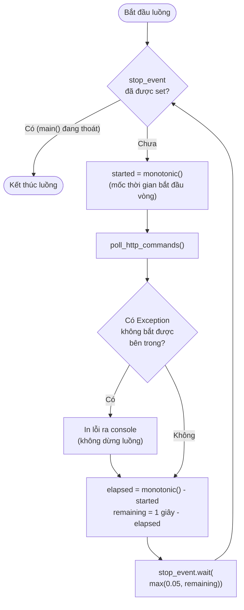

# Lưu đồ `control_poll_loop(stop_event)` — dòng 482

Chạy ở **luồng riêng** (tách khỏi vòng lặp chính đọc cảm biến) để nhịp đọc
lệnh luôn đúng 1 giây, không bị cảm biến (DHT ~1s, HTTP request 0.3-0.9s)
làm chậm — đảm bảo yêu cầu "đổi trạng thái chậm nhất 2 giây" của đề.

**Vì sao phải trừ `elapsed` thay vì `sleep(1)` cố định?** Nếu chỉ
`sleep(1)` SAU mỗi lần gọi `poll_http_commands()`, chu kỳ thực tế sẽ là
`1s + thời gian request (~0.3-0.9s)` = 1.3-1.9s — đã đo được thực tế **1.977s**
cho nút Manual trước khi sửa, chỉ còn cách mốc 2 giây của đề **23 mili giây**.
Trừ `elapsed` đi thì chu kỳ luôn đúng 1 giây, kéo độ trễ tối đa xuống còn
khoảng **1.4 giây**.
