# Lưu đồ `poll_http_commands()` — dòng 383

Đọc lại **toàn bộ** trạng thái 8 nút (channel LỆNH) — đường đọc **duy nhất**
vì Pi không subscribe MQTT.

```mermaid
flowchart TD
    START([Bắt đầu]) --> GET["GET .../feeds.json<br/>results = 30 bản ghi gần nhất"]
    GET --> ERR{"Lỗi mạng /<br/>JSON không hợp lệ?"}
    ERR -- "Có" --> NETFAIL["note_network_fail()"] --> END1([Kết thúc])
    ERR -- "Không" --> NETOK["note_network_ok()"]

    NETOK --> INIT["found = {mode, led,<br/>buzzer, relay: false}<br/>changed = false"]
    INIT --> REV{{"Quét NGƯỢC từ bản ghi<br/>mới nhất về cũ nhất"}}

    REV --> FMODE{"found['mode'] = false<br/>VÀ field Mode của<br/>bản ghi này khác null?"}
    FMODE -- "Có" --> SETMODE["new_mode = manual/auto<br/>theo to_bool(giá trị)<br/>khác state cũ? -> changed=true<br/>found['mode'] = true"] --> FLED
    FMODE -- "Không" --> FLED{"tương tự cho<br/>field LED"}

    FLED -- "Có & chưa found" --> SETLED["cập nhật state['led_cmd']<br/>found['led']=true"] --> FBUZ
    FLED -- "Không" --> FBUZ{"tương tự cho<br/>field Buzzer"}

    FBUZ -- "Có & chưa found" --> SETBUZ["cập nhật state['buzzer_cmd']<br/>found['buzzer']=true"] --> FRELAY
    FBUZ -- "Không" --> FRELAY{"tương tự cho<br/>field Relay"}

    FRELAY -- "Có & chưa found" --> SETREL["cập nhật state['relay_cmd']<br/>found['relay']=true"] --> ALLFOUND
    FRELAY -- "Không" --> ALLFOUND{"Cả 4 field đã<br/>found hết chưa?"}

    ALLFOUND -- "Rồi" --> BREAK["dừng quét sớm<br/>(break)"]
    ALLFOUND -- "Chưa & còn bản ghi" --> REV
    ALLFOUND -- "Chưa & hết bản ghi" --> BREAK

    BREAK --> CHANGED{"changed == true?"}
    CHANGED -- "Không" --> END2([Kết thúc, im lặng])
    CHANGED -- "Có" --> LOG1["log_event('NHAN LENH: ...')<br/>(có mili giây, đối chiếu<br/>với log Node-RED)"]
    LOG1 --> APPLY["apply_outputs()"]
    APPLY --> LOG2["log_event('DA AP DUNG XONG: ...')"]
    LOG2 --> END3([Kết thúc])
```

**Vì sao phải quét ngược và dừng ngay khi field đã "found"?** Mỗi lần Web
ghi riêng lẻ 1 field sẽ tạo ra **1 dòng mới** trên ThingSpeak, 3 field còn
lại của dòng đó là `null`. Nếu chỉ lấy dòng mới nhất thì sẽ đọc nhầm 3 field
kia là "chưa có lệnh". Quét ngược từ mới → cũ và chỉ lấy giá trị
**khác null đầu tiên** cho từng field riêng biệt mới đảm bảo lấy đúng lệnh
gần nhất của cả 4 field cùng lúc.
