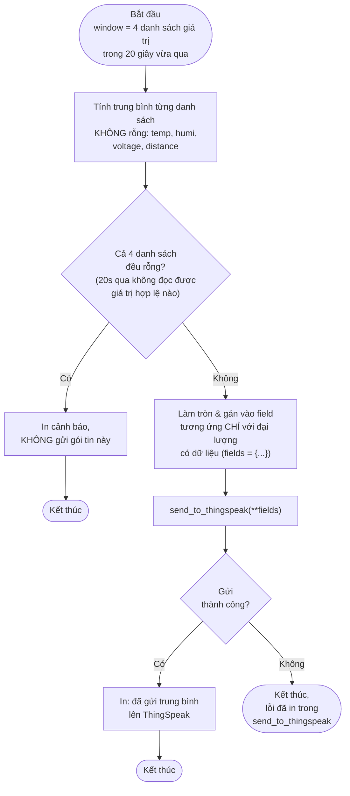

# Lưu đồ `send_window_average(window)` — dòng 539

Đây chính là cơ chế thực hiện đúng yêu cầu đề bài: *"nếu dữ liệu cảm biến bị
lỗi thì không được gửi lên Server mà phải đọc lại và gửi dữ liệu khác"* — chỉ
đại lượng nào **có ít nhất 1 giá trị hợp lệ** trong 20 giây mới được đưa vào
gói tin gửi đi; nếu tất cả đều lỗi thì bỏ hẳn gói tin đó thay vì gửi dữ liệu
rác.
