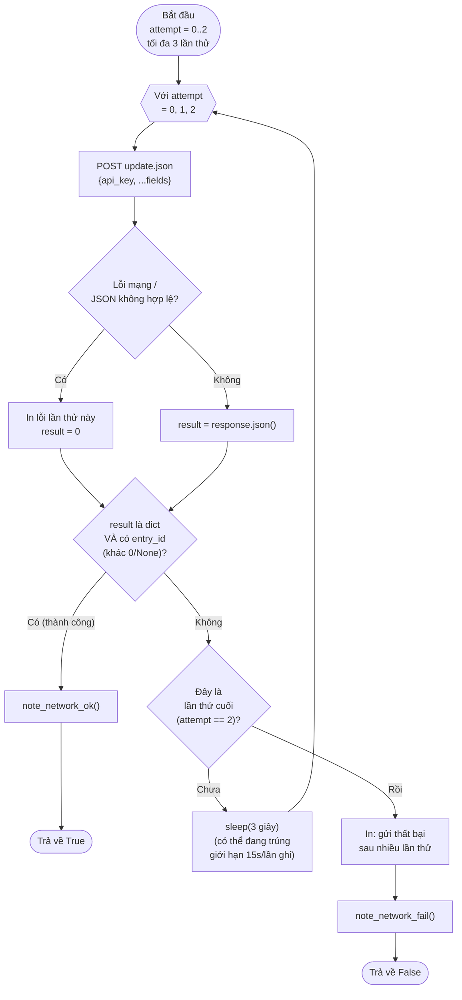

# Lưu đồ `send_to_thingspeak(**fields)` — dòng 510

**Lưu ý quan trọng:** ThingSpeak khi từ chối ghi (do chưa đủ ~15 giây kể từ
lần ghi trước lên **cùng 1 channel**) vẫn trả về **HTTP 200** nhưng nội dung
là số `0`, KHÔNG phải lỗi HTTP — nên `response.raise_for_status()` không đủ
để phát hiện, bắt buộc phải kiểm tra `entry_id` trong nội dung trả về.
