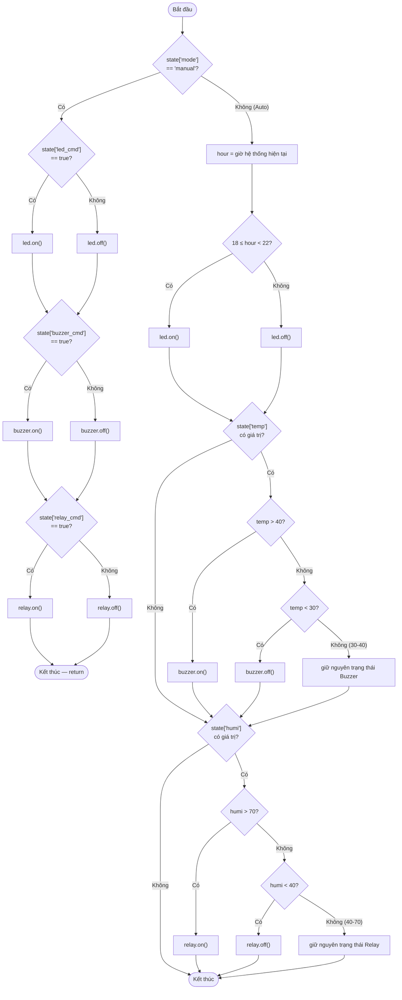

# Lưu đồ `apply_outputs()` — dòng 338

Đúng nguyên văn điều kiện đề bài (giữ nguyên từ buổi 5 lớp thầy Thanh): LED
sáng khung giờ cố định 18h-22h; Buzzer/Relay có **vùng đệm giữ nguyên**
(30-40°C cho Buzzer, 40-70% cho Relay) để tránh nhấp nháy liên tục quanh
ngưỡng.
