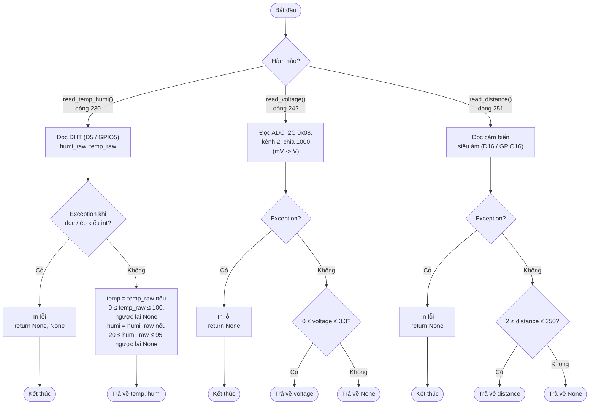

# Lưu đồ đọc cảm biến — `read_temp_humi()`, `read_voltage()`, `read_distance()`

Cả 3 hàm dùng chung một khuôn mẫu: đọc phần cứng → bắt lỗi → lọc theo dải
hợp lệ.

`None` được coi là "không đọc được / dữ liệu bất thường" — nơi gọi các hàm
này (`main()`) sẽ **loại bỏ**, không cộng vào `window[]` và không gửi lên
Server, đúng yêu cầu đề bài.
