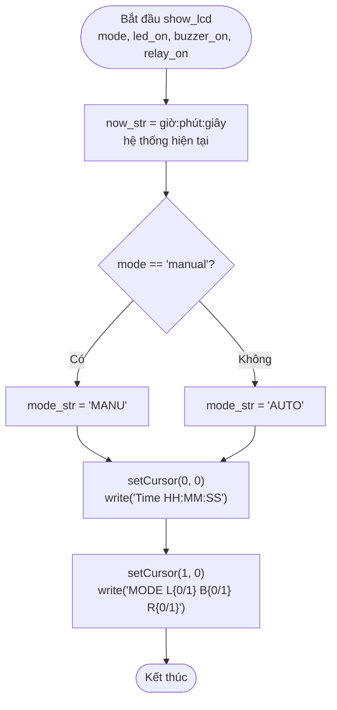
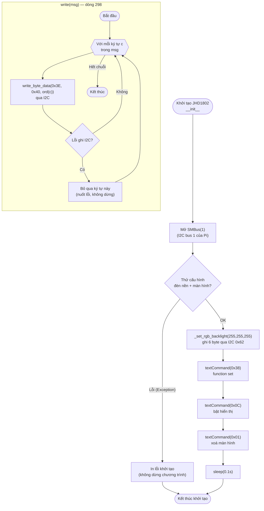

# Lưu đồ LCD — `show_lcd()` (dòng 309) và class `JHD1802` (dòng 263)

**Vì sao mọi thao tác I2C đều bọc `try/except` và nuốt lỗi?** Màn hình
LCD/đèn nền chỉ là thiết bị hiển thị phụ — nếu dây I2C lỏng hoặc màn hình
hỏng, chương trình vẫn phải tiếp tục đọc cảm biến, điều khiển thiết bị và
gửi dữ liệu lên Server bình thường, không được để một khối hiển thị làm treo
toàn bộ chương trình.
