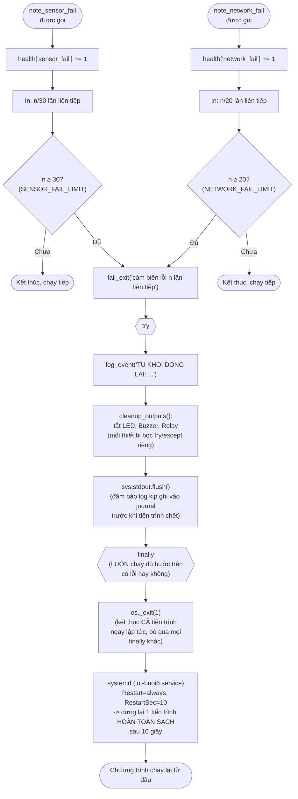

# Lưu đồ nhóm Tự phục hồi — tính năng thêm của buổi 6

`fail_exit()` (dòng 174), `note_sensor_fail()` (dòng 201),
`note_network_fail()` (dòng 213), `cleanup_outputs()` (dòng 161).

**Vì sao `os._exit()` thay vì `sys.exit()`?** `fail_exit()` có thể được gọi
từ **luồng đọc lệnh** (`control_poll_loop`, qua `note_network_fail()`) chứ
không chỉ luồng chính. `sys.exit()` trong một luồng phụ chỉ kết thúc đúng
luồng đó — tiến trình vẫn sống nhưng "què", không còn đọc lệnh nữa mà
không ai biết. `os._exit()` kết thúc **toàn bộ tiến trình** dù gọi từ luồng
nào.

**Vì sao bọc `try/finally`?** Đã gặp lỗi thật khi test: thiếu `import sys`
khiến `NameError` bên trong khối này bị `except Exception` của vòng lặp gọi
nó **nuốt mất** — bộ đếm lỗi cứ tăng (21/20, 22/20...) mà chương trình không
bao giờ thực sự thoát/khởi động lại. Đặt `os._exit(1)` trong `finally` đảm
bảo dù bước log/dọn dẹp phía trên có lỗi gì, tiến trình vẫn chắc chắn thoát.
