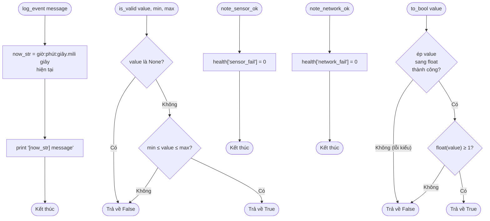

# Lưu đồ các hàm phụ trợ (một dòng logic, dùng chung nhiều nơi)

`log_event()` (127), `is_valid()` (139), `to_bool()` (370),
`note_sensor_ok()` (197), `note_network_ok()` (209).

**Vì sao `to_bool` dùng `>= 1` thay vì so sánh `== 1`?** ThingSpeak trả field
dạng chuỗi (`"1"`, `"0"`, có khi `"1.0"`) — ép sang `float` rồi so sánh
`>= 1` chịu được cả các biến thể định dạng số này, tránh so sánh chuỗi trực
tiếp dễ sai (`"1" == 1` là `False` trong Python).
